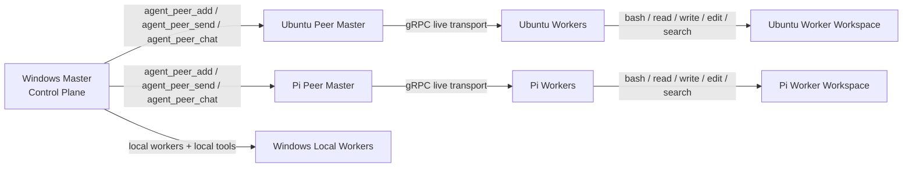

# Clawx

[](https://www.npmjs.com/package/@halfagiraf/clawx) [](https://github.com/stevenmcsorley/clawx/blob/main/LICENSE) [](https://www.npmjs.com/package/@halfagiraf/clawx)

Terminal-first coding and execution agent with:
- local coding-agent workflows
- headless npm/package usage for scripts, CI, and app backends
- a hardened local worker pool with persona and memory
- explicit LAN peer-master federation
- peer-hosted worker delegation across Windows, Ubuntu, and Raspberry Pi
- Forge for extension/capability discovery and scaffolding
- Scout for model/dataset exploration workflows
- gRPC as the canonical live master↔worker transport

Clawx can be used as:
- a coding agent in the terminal
- a headless coding/automation engine in Node apps
- a local worker/master orchestration system
- an explicit multi-machine control plane across peer masters and peer-hosted workers
- an extension/capability builder through Forge

> **Always update before use — this project is in active development and can change quickly:**
> ```bash
> npm install -g @halfagiraf/clawx@latest
> ```

> **Beta** — Clawx is under active development. It works well with the providers and federation/runtime paths we've tested, but not every combination has been battle-tested yet. If you hit a bug, [open an issue](https://github.com/stevenmcsorley/clawx/issues) — we fix things fast.

Clawx started because tools like OpenClaw kept getting heavier. Prompts ballooned, context windows filled up, and local models choked. We wanted the good parts — the tool-calling loop, the terminal UI, the coding tools — without the bloat. So we built something lean on top of the open-source [pi-coding-agent](https://github.com/badlogic/pi-mono) SDK: an agent that runs local models on modest hardware, hits DeepSeek when you need more muscle, and now scales across explicit peer masters and peer-hosted workers when you want real multi-machine execution.

> **Fair warning:** Clawx runs with the guardrails off. It will create files, delete files, install packages, and execute shell commands — all without asking you first. That's the point. No confirmation dialogs, no “are you sure?”, no waiting around. You give it a task, it gets on with it. This makes it ideal for disposable environments, home labs, Raspberry Pis, VMs, and machines you're happy to let rip.

## What Clawx is today

Clawx can now be used as:
- a local terminal-first coding agent
- a headless npm package inside scripts, CI jobs, and app backends
- a local worker/master orchestration system
- an explicit LAN peer-federation system
- a remote worker control plane from one master to another
- a capability-discovery and extension-scaffolding surface through Forge
- a research-oriented model/dataset exploration surface through Scout

That means one machine can:
- register another master on the LAN
- spawn workers behind that peer master
- chat with those workers
- manage their persona and memory
- send them real delegated tool tasks
- get real results back
- restart a peer master and have eligible persisted workers come back automatically

## Why this is different

Clawx is not only a single local coding chat.

It already combines several real modes that are easy to miss if you only skim the README:
- **Coding agent** — normal terminal coding and execution workflow
- **Programmatic npm usage** — run Clawx headlessly inside scripts, CI, and app backends
- **Workers** — explicit local worker/master orchestration
- **Peer federation** — explicit LAN master-to-master worker delegation
- **Forge** — research and scaffold new Clawx capabilities/extensions
- **Scout** — explore model and dataset options for capability work and research

Those are real current product directions, but they are not all equally productized yet. The most mature paths today are the coding-agent flow, worker/peer runtime, and headless programmatic task execution.

## What is proven right now

Fresh real runs have validated:
- Windows ↔ Ubuntu peer federation
- Windows ↔ Raspberry Pi peer federation
- peer worker spawn
- peer worker chat
- peer worker persona set/show
- peer worker memory update/show
- explicit worker rehydration after master restart
- automatic worker rehydration on master startup for eligible auto-start workers
- peer-routed delegated worker tool execution for:
  - `bash`
  - `read`
  - `write`
  - `edit`
  - `ls`
  - `find`
  - `grep`
  - `search_files`
- file create/edit/read/delete workflows on peer-hosted workers
- truthful delegated task completion for the previously failing peer-routed `bash` path

For the fuller current status, see:
- [`docs/current-capabilities.md`](docs/current-capabilities.md)

## Core use cases

### 1. Local coding agent
Use Clawx as a normal terminal coding agent that can:
- create files
- edit code
- run shell commands
- inspect repos
- iterate until the job is done

### 2. Local worker orchestration
Use one master with multiple local workers to:
- split work across workers
- inspect status and health
- delegate file/search/bash tasks
- keep worker identity with persona and memory

### 3. Ubuntu build/debug worker
Use Ubuntu as a peer-hosted worker box for:
- builds
- debugging
- repo inspection
- shell workflows
- targeted code/file changes

### 4. Raspberry Pi ops/config worker
Use Pi as a lightweight LAN-side worker for:
- shell commands
- config inspection
- remote file patching
- small automation tasks
- edge/device-side troubleshooting

### 5. Remote file CRUD and patching
Peer-hosted workers can now do real remote file workflows such as:
- create file
- edit file
- read file
- delete file

### 6. Explicit multi-machine task delegation
Instead of hidden mention routing or heuristic collaboration, Clawx uses explicit tools to:
- target peer masters
- target named peer-hosted workers
- send real delegated tasks
- inspect truthful status/results

### 7. Programmatic backend task engine
Clawx can also be installed as an npm package and used from Node.js for:
- headless codegen
- scripted multi-turn runs
- CI automation
- backend task execution inside larger apps

### 8. Forge capability building
Forge can be used to:
- explore HuggingFace models and datasets
- inspect existing extensions
- scaffold new Clawx capabilities
- prototype MCP/tool ideas and guard-style safety helpers

### 9. Scout research workflows
Scout is the research-oriented mode for exploring model and dataset options and comparing possibilities before you commit to implementation work.

## Quick start

### Install

```bash
npm install -g @halfagiraf/clawx
```

### Initialize

```bash
clawx init
```

### Launch the default TUI

```bash
clawx
```

### Build from source

```bash
git clone https://github.com/stevenmcsorley/clawx.git
cd clawx
npm install
npm run build
npm link
```

## Basic usage

```bash
# Launch TUI (default)
clawx

# Launch TUI with an initial prompt
clawx "Create a Flask app with auth and a SQLite database"

# Single-shot run
clawx run "Create a hello world Express server"

# Use a specific model/provider without switching profile
clawx --model qwen2.5-coder:7b-instruct --provider ollama
clawx --model deepseek-chat --provider deepseek

# Basic readline REPL
clawx --basic

# Continue last session
clawx continue

# Build Clawx extensions with Forge
clawx forge "Build a sentiment analysis tool for product reviews"
```

## Local worker / master quick start

```bash
# Start a master
clawx agent_serve --name master --port 3000

# List workers and health
clawx agent_list

# Spawn a local worker
clawx agent_spawn_local --name worker1

# Send a task to a local worker
clawx agent_send --agent_name worker1 --tool ls --params {}

# Chat with a local worker
clawx agent_chat --agent_name worker1 --message "Inspect this workspace"

# Check result / cleanup
clawx agent_result --task_id <id>
clawx agent_cleanup --force true
```

## Peer federation quick start

### 1. Start a peer master
On the remote machine:

```bash
clawx agent_peer_serve --name ubuntu-master --port 43210
```

### 2. Register that peer from your main machine

```bash
clawx agent_peer_add --name ubuntu-master --endpoint http://192.168.1.183:43210
```

### 3. Inspect peer workers

```bash
clawx agent_peer_list_workers --peer_name ubuntu-master
```

### 4. Spawn a worker behind the peer master

```bash
clawx agent_peer_send --peer_name ubuntu-master --tool agent_spawn_local --params '{"name":"remote-worker"}'
```

### 5. Send delegated tool tasks to that peer-hosted worker

```bash
clawx agent_peer_send --peer_name ubuntu-master --worker_name remote-worker --tool bash --params '{"command":"echo hello && pwd"}'
clawx agent_peer_send --peer_name ubuntu-master --worker_name remote-worker --tool ls --params '{"path":"."}'
clawx agent_peer_send --peer_name ubuntu-master --worker_name remote-worker --tool read --params '{"path":"agent-config.json"}'
```

### 6. Chat with the peer-hosted worker

```bash
clawx agent_peer_chat --peer_name ubuntu-master --worker_name remote-worker --message "Summarize your workspace"
```

### 7. Manage persona and memory on the peer-hosted worker

```bash
clawx agent_peer_persona_show --peer_name ubuntu-master --worker_name remote-worker
clawx agent_peer_persona_set --peer_name ubuntu-master --worker_name remote-worker --role "Remote build worker"
clawx agent_peer_memory_show --peer_name ubuntu-master --worker_name remote-worker
clawx agent_peer_memory_update --peer_name ubuntu-master --worker_name remote-worker --summary "Handles Ubuntu build and inspection tasks"
```

## Triple-OS peer federation example

Below is the kind of setup Clawx now supports in real use:
- Windows as the main control plane
- Ubuntu as a peer master and remote build/debug box
- Raspberry Pi as a peer master and lightweight edge/ops box



### What this setup has already been used to do

From one Windows machine, Clawx has been used to:
- update npm packages on Ubuntu and Raspberry Pi
- update global Clawx installs remotely on Ubuntu and Raspberry Pi
- restart remote peer masters and verify health
- register peer masters explicitly on the LAN
- spawn workers behind peer masters
- inspect peer worker inventory
- chat with peer-hosted workers
- set/show persona on peer-hosted workers
- update/show memory on peer-hosted workers
- run delegated worker tool tasks remotely
- inspect worker logs and debug runtime issues truthfully

### Real delegated operations already validated

Fresh real runs have validated remote peer-worker execution for:
- `bash`
- `read`
- `write`
- `edit`
- `ls`
- `find`
- `grep`
- `search_files`

And real remote file workflows have been validated on Ubuntu and Pi for:
- create file
- edit file
- read file
- delete file

### Why this matters

This makes Clawx useful as a small explicit multi-machine control plane for:
- home labs
- dev boxes
- Raspberry Pi edge systems
- remote debugging environments
- contributors building new federation and worker-management features

## Tool groups

### Coding and file tools
- `read`
- `write`
- `edit`
- `bash`
- `grep`
- `find`
- `ls`
- `search_files`
- `git_status`
- `git_diff`
- `ssh_run`

### Local worker/master tools
- `agent_serve`
- `agent_list`
- `agent_spawn_local`
- `agent_send`
- `agent_chat`
- `agent_status`
- `agent_result`
- `agent_cleanup`
- `agent_cleanup_port`
- `agent_cleanup_processes`
- `agent_master_status`

### Peer federation tools
- `agent_peer_add`
- `agent_peer_chat`
- `agent_peer_send`
- `agent_peer_serve`
- `agent_peer_list_workers`

### Persona / memory tools
- `agent_persona_show`
- `agent_persona_set`
- `agent_memory_show`
- `agent_memory_update`
- `agent_peer_persona_show`
- `agent_peer_persona_set`
- `agent_peer_memory_show`
- `agent_peer_memory_update`

### Forge tools
- `hf_search`
- `hf_model_info`
- `hf_readme`
- `hf_dataset_search`
- `forge_write_capability`
- `forge_list_capabilities`

## Model setup

Clawx requires a model that supports **structured tool calling** (returning `tool_calls` in the API response, not just text). This is critical — the agent loop depends on it.

### Model compatibility and benchmarks

Tested on Windows 11, RTX 3060 12GB, 2026-03-15.

| Model | Provider | Tool calling | VRAM | Benchmark | Status |
|-------|----------|-------------|------|-----------|--------|
| **glm-4.7-flash:latest** | Ollama | Structured `tool_calls` | ~5 GB | 12 turns, 13 tool calls — write file + run python | **Recommended local** |
| **Qwen3.5-35B-A3B** (MoE) | Ollama | Structured `tool_calls` | ~12 GB | 35B params, only 3B active per token | **Best local if you have the VRAM** |
| **Qwen2.5-Coder-14B-abliterated Q4_K_M** | Ollama | Text-based (auto-parsed) | ~9 GB | Text tool parser converts JSON output to structured calls | **Works (with parser)** |
| Qwen2.5-Coder-14B-abliterated Q4_K_M | llama-server `--jinja` | Text-based (auto-parsed) | ~9 GB | Same parser support | Works (with parser) |
| GPT-4o / GPT-4-turbo | OpenAI API | Structured `tool_calls` | — | N/A (cloud) | Works |
| **DeepSeek-V3 (deepseek-chat)** | DeepSeek API | Structured `tool_calls` | — | N/A (cloud) | **Works, very cheap** |
| DeepSeek-R1 (deepseek-reasoner) | DeepSeek API | Structured `tool_calls` (via chat) | — | N/A (cloud) | Works |
| Claude 3.5+ | Anthropic API | Structured `tool_calls` | — | N/A (cloud) | Works |

> **Qwen text tool parser:** Some GGUFs output tool calls as JSON text instead of structured `tool_calls` objects. Clawx automatically detects and parses these text-based tool calls, converting them to proper structured calls.

### Option 1: GLM-4.7-Flash via Ollama (recommended local)

Requires: [Ollama](https://ollama.com/) installed, ~5GB VRAM.

```bash
# Start Ollama if needed
ollama serve

# Pull model
ollama pull glm-4.7-flash:latest

# Configure Clawx
cat > .env << 'EOF'
CLAWDEX_PROVIDER=ollama
CLAWDEX_BASE_URL=http://localhost:11434/v1
CLAWDEX_MODEL=glm-4.7-flash:latest
CLAWDEX_API_KEY=not-needed
CLAWDEX_THINKING_LEVEL=off
CLAWDEX_MAX_TOKENS=8192
EOF

# Run Clawx
clawx run "Create a Python script that prints the first 20 Fibonacci numbers"
```

### Option 2: DeepSeek API

```bash
cat > .env << 'EOF'
CLAWDEX_PROVIDER=deepseek
CLAWDEX_BASE_URL=https://api.deepseek.com/v1
CLAWDEX_MODEL=deepseek-chat
CLAWDEX_API_KEY=your-key-here
CLAWDEX_THINKING_LEVEL=off
CLAWDEX_MAX_TOKENS=8192
EOF

clawx
```

### Option 3: Import your own GGUF into Ollama

```bash
cat > Modelfile << 'EOF'
FROM /path/to/your-model.gguf

PARAMETER temperature 0.7
PARAMETER num_ctx 16384
PARAMETER stop <|im_end|>
PARAMETER stop <|endoftext|>

TEMPLATE """{{- if .System }}<|im_start|>system
{{ .System }}<|im_end|>
{{ end }}{{- range .Messages }}<|im_start|>{{ .Role }}
{{ .Content }}<|im_end|>
{{ end }}<|im_start|>assistant
"""
EOF

ollama create my-model -f Modelfile
clawx --model my-model --provider ollama
```

## TUI and interaction model

Clawx uses the pi-coding-agent interactive TUI as its main interface.

### TUI features
- syntax-highlighted code in tool results
- diff rendering for edit operations
- spinner animations during tool execution
- Ctrl+P to cycle models
- Ctrl+C to cancel
- Ctrl+D to quit
- session branching and tree navigation
- markdown rendering in responses
- `/chat` to toggle between agent mode and chat mode
- fresh-session awareness of the currently registered toolset

### Agent mode vs chat mode

| Mode | Tools | When |
|------|-------|------|
| **Agent mode** | Tools enabled | default coding/execution workflow |
| **Chat mode** | No tools | discussion/explanation only |

If a model does not support structured tool calling, Clawx can fall back to chat mode or use text-tool parsing where supported.

## Programmatic usage

Clawx can also be used programmatically as an npm package for headless tasks, multi-turn scripted runs, CI/codegen, and backend integration.

The repo already includes examples under [`examples/`](examples/) such as:
- `run-task.mjs`
- `multi-turn.mjs`
- `custom-config.mjs`
- `ci-codegen.mjs`

For the current programmatic usage story, exported API surface, examples, and guidance on embedding Clawx in a larger app, see:
- [`docs/programmatic-usage.md`](docs/programmatic-usage.md)

## Forge

Forge is Clawx’s extension-building mode.

Use it to:
- research models and datasets on HuggingFace
- inspect existing extensions
- scaffold new Clawx capabilities
- explore tool ideas, MCP ideas, and guard/safety helpers before enabling them in normal workflow

Examples:

```bash
clawx forge
clawx forge "Build a capability that summarizes CSV files"
```

For a fuller guide to what Forge is good for, what kinds of extensions fit Clawx well, MCP ideas, HuggingFace-backed capability discovery, and example Forge prompts, see:
- [`docs/forge-guide.md`](docs/forge-guide.md)

## Honest limitations

Current limitations still include:
- no authentication/authorization
- explicit peer registration is required
- stale occupied worker ports can still happen, though spawn truth is now honest
- worker lifecycle is improved, but old historical worker clutter can still accumulate until cleaned intentionally
- periodic background cleanup/policy management is still not a finished lifecycle feature
- worker chat continuity across prior delegated tasks is improved, but exact later summarization can still blur some detail

## Documentation

- [`docs/current-capabilities.md`](docs/current-capabilities.md) — current proven runtime/capability status
- [`docs/prompting-guide.md`](docs/prompting-guide.md) — example prompts for peer network management, worker usage, and operational requests
- [`docs/forge-guide.md`](docs/forge-guide.md) — what Forge is good for, what kinds of capabilities fit Clawx well, and ideas for MCPs, guard tools, and HuggingFace-backed extensions
- [`docs/programmatic-usage.md`](docs/programmatic-usage.md) — how to use Clawx as an npm package in scripts, CI, and larger apps

## License

MIT
